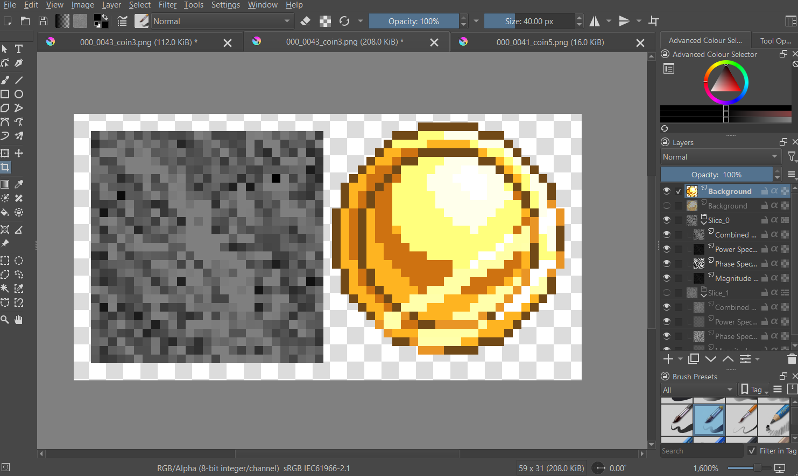
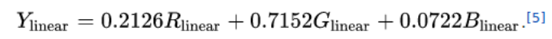
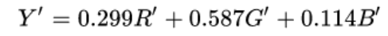
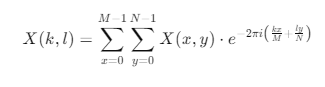
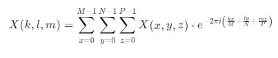

# 2D: Fourier Transform (3D)

A Krita plugin for visualizing the 3D Fourier transform.  
Input: several image layers (max size 128x128 px).  
Output: a set of folders containing the Fourier transform of each layer - **power**, **phase**, and **magnitude** spectra, plus a combined FT result using phase and magnitude.

---

### Update
After submission, a bug was found: the third dimension was not being correctly added to the sum, which degraded the plugin to a set of 2D FTs. This has been fixed, but now all image layers must have the same dimensions.  

Another fix addressed duplicate error messages when images larger than the allowed size were processed (based on feedback in *Grades*).  
Changes in the documentation after the update are marked in *italics*.




---

## Installation
Place the plugin in Krita’s plugin folder:  
`Krita (x64)/share/krita/pykrita`  

After restarting Krita, enable it in:  
`Settings -> Configure Krita... -> Python Plugin Manager -> check FT3D`.

---

## User Documentation
Input: 1–x image layers of the *same dimensions*, each up to 128x128 px.  
Run via: `Tools -> Scripts -> Fourier Transform 3D`.  
The program will compute the FT and produce x folders with outputs.

---

## Theoretical Documentation

### RGB to Grayscale
The first step is converting RGB images to grayscale. This uses weighted averages of R, G, and B to reflect human perception — e.g. green is perceived ~10× brighter than blue.  

Psychological experiments determined exact weights for accurate brightness perception:  
  

Since the human eye is more sensitive to changes in dark regions, a linear approximation of gamma compression is used here, avoiding complexity:  


Source: [E2EML – Convert RGB to grayscale](https://e2eml.school/convert_rgb_to_grayscale#:~:text=An%20intuitive%20way%20to%20convert,into%20a%20reasonable%20gray%20approximation)

---

### Fourier Transform – 1D
1D FT analyzes oscillating signals (sound). Any signal can be represented as a sum of sine and cosine waves.  
It returns:
- **Magnitude** – strength of each frequency  
- **Phase** – frequency shift

---

### Fourier Transform – 2D
Extension of 1D FT into two dimensions, mainly used for images. Useful for detecting defects or noise.  
Returns:
- **Magnitude** – frequency intensity  
- **Phase** – frequency shift  
- **Power** – magnitude squared  

---

### Fourier Transform – 3D
Extends 2D FT to volumetric data (3D textures or image stacks). Each voxel has an intensity analyzed in three dimensions.  
Returns the same components as 2D FT.

---

### Discrete Fourier Transform (DFT)
Mathematical formula to decompose signals/images into base components:  
  

Because direct computation is slow, the **Fast Fourier Transform (FFT)** is often used. However, this plugin uses a hand-written DFT implementation for clarity.  
For 2D/3D extension, additional variables are added:  
  
  

Results are log-scaled with `log(1+val)` for visibility.

---

### 2D Shift
Shifts the zero frequency to the image center by swapping quadrants:  
- Top-left ↔ Bottom-right  
- Top-right ↔ Bottom-left  

This makes low frequencies central and high frequencies peripheral.

---

### Combining Magnitude and Phase
For visualization, magnitude can be mapped to brightness and phase to hue.  
In this plugin, grayscale is used:  
 ``Brightness = NormalizedMagnitude × ( 1 + 0.5 × PhaseNormalized )``.

 The normalized magnitude is then found like this: <br/>
 
Steps:
1. Find max magnitude  
2. Normalize magnitude and phase  
3. Compute brightness  
4. Clamp and rescale to [0, 255]  
5. Slightly reduce brightness to avoid overexposure

---

### Normalization
Data is scaled to [0, 255]:  
1. Find min and max values  
2. Compute scale = 255 / (max – min)  
3. Normalize and apply gamma correction

---

## Developer Documentation

### Structure
All functionality is implemented in one class `FourierTransformPlugin`, inheriting from `Extension`.

### Key Methods
- `__init__(self, parent)` – initializes the plugin  
- `__setup(self)` – called during Krita init  
- `__createActions(self, window)` – adds the menu entry under Tools → Scripts  
- `__apply_fourier_transform(self)` – computes and displays the FT  
- `__nodes_to_grayscale(self, nodes)` – converts layers to grayscale (errors if >128x128)  
- `__compute_dft_3D(self, volume)` – computes the 3D DFT, log-scales magnitude and power  
- `__shift_dft_2d(self, data)` – shifts zero frequency to center  
- `__combine_magnitude_phase(self, magnitude, phase)` – combines spectra into grayscale  
- `__normalize(self, data, gamma)` – normalizes to [0, 255] with gamma correction  
- `__show_result_3d(self, result, title)` – displays 3D spectra  
- `__show_result(self, result, title, index)` – writes outputs into layers  
- `__find_group_by_name(self, parent_node, group_name)` – finds/creates a group layer

---

## Development Notes
Resources used during development:
- [Restoring a picture using the Fourier Transform!](https://www.youtube.com/watch?v=bpn3DEULv8g)  
- [2D Fourier Transform – An Example](https://www.youtube.com/watch?v=js4bLBYtJwY&t=65s)  
- [But what is the Fourier Transform? A visual introduction](https://www.youtube.com/watch?v=spUNpyF58BY&t=477s)  
- [Image Processing with Fourier Transform](https://www.youtube.com/watch?v=oACegp4iGi0&t=47s)  

Additional references:
- Class exercise code  
- [Krita Scripting Book](https://scripting.krita.org/lessons/introduction)  
- [Krita API](https://api.kde.org/krita/html/classNode.html)  
- ChatGPT for some intances, for example:<br/>
Question: <br/>
```
how do i look up if there is a group layer called a certain name?
```
Answer: <br/>
```
To check if a group layer with a specific name exists in the document, you can loop through the child nodes of the root node (or any other parent node) and check if a node matches the given name and is of the grouplayer type.

Here's a function to look up if a group layer with a certain name exists:

Function to Check for Group Layer by Name:
def find_group_by_name(self, parent_node, group_name):
    Search for a group layer with the specified name under the given parent node.
    Returns the group node if found, otherwise returns None.
    
    for node in parent_node.childNodes():
        if node.name() == group_name and node.type() == "grouplayer":
            return node
    return None

You can use this function to check if a group exists and create it if it doesn't.
